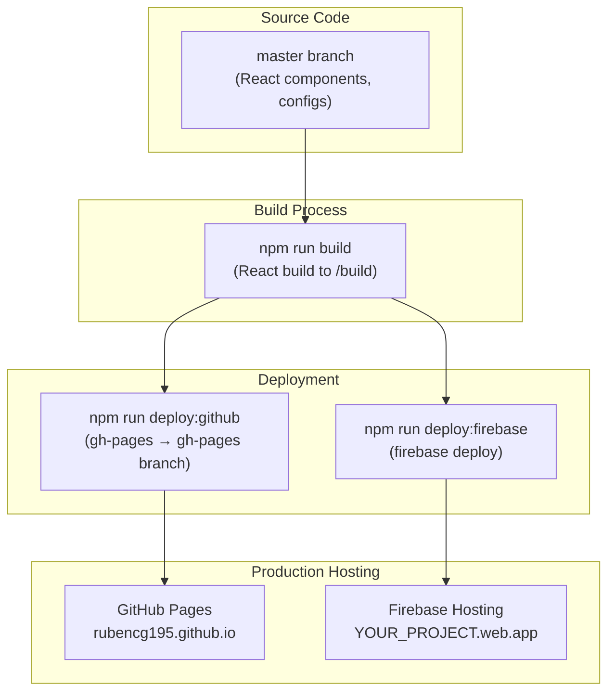

# Ruben Chevez - Professional MLOps Portfolio

A modern, professional portfolio website showcasing Machine Learning Operations expertise, built with React, Tailwind CSS, and Material Design principles.

## 🚀 Live Portfolio

**Live Site**: [https://rubencg195.github.io](https://rubencg195.github.io)

## ✨ Features

- **🤖 Advanced MLOps Projects**: AWS Bedrock, Claude 3.7, and cutting-edge AI implementations
- **🎨 Material Design**: Professional FAANG-ready styling with Tailwind CSS
- **📱 Fully Responsive**: Mobile-first design optimized for all devices
- **🔒 Privacy-Focused**: Secure contact methods with hidden personal details
- **⚡ Performance Optimized**: Fast loading with production-grade optimization
- **🧩 Modular Architecture**: Reusable components for easy maintenance
- **🌙 Dark/Light Theme**: Toggle between themes with persistent preference
- **📊 Professional Timeline**: Interactive experience and education sections
- **🔗 Dynamic Project Loading**: Automatic GitHub repository integration

## 📋 Prerequisites

- [Node.js](https://nodejs.org/) (version 18 or higher recommended)
- [npm](https://www.npmjs.com/) (comes with Node.js)
- [Git](https://git-scm.com/) for version control

## 🛠️ Installation & Setup

### 1. Clone the Repository
```bash
git clone https://github.com/rubencg195/rubencg195.github.io.git
cd rubencg195.github.io
```

### 2. Install Dependencies
```bash
npm install
```

### 3. Start Development Server
```bash
npm start
```

The application will open at [http://localhost:3000](http://localhost:3000).

## 📁 Project Structure

```
src/
├── App.js                      # Main application with routing
├── index.js                    # Application entry point
├── index.css                   # Global styles and Tailwind directives
├── components/
│   ├── index.js                # Central component exports
│   ├── Navbar.js               # Reusable navigation component
│   ├── HeroSection.js          # Flexible hero section component
│   ├── Section.js              # Section wrapper with backgrounds
│   ├── SectionHeader.js        # Consistent section headers
│   ├── Button.js               # Button variants (Primary, Secondary, Action)
│   ├── Projects.js             # Projects grid container
│   ├── ProjectCard.js          # Individual project cards
│   ├── ProjectDetail.js        # Detailed project view with README
│   ├── Timeline.js             # Reusable timeline component
│   ├── ExperienceEducation.js  # Experience and education sections
│   └── UnicodeIcons.js         # Simple emoji-based icons
├── contexts/
│   └── ThemeContext.js         # Global theme management
├── utils/
│   └── githubUtils.js          # GitHub API utilities
└── constants.js                # Configuration and data constants

public/
├── index.html                  # HTML template with SEO meta tags
├── images/
│   └── profile/
│       └── profile.jpeg        # Professional profile image
└── favicon.ico                 # Website icon

tailwind.config.js              # Tailwind CSS configuration with Material Design
postcss.config.js               # PostCSS configuration
package.json                    # Dependencies and deployment scripts
```

## 🎯 Managing Your Portfolio

### Adding New Projects

1. **Add Repository Information** in `src/constants.js`:
```javascript
export const REPOSITORIES = [
  {
    id: 'your-new-project',
    name: 'Your Project Name',
    description: 'Detailed description of your project and its impact',
    url: 'https://github.com/yourusername/your-project',
    owner: 'yourusername',
    repo: 'your-project',
    technologies: ['Technology1', 'Technology2', 'Technology3']
  },
  // ... existing projects
];
```

2. **Project Order**: Projects appear in the order listed (newest first recommended)

3. **README Integration**: The portfolio automatically fetches and displays your GitHub README files

### Updating Professional Experience

1. **Edit Experience Data** in `src/constants.js`:
```javascript
export const EXPERIENCE_FALLBACK = [
  {
    title: 'Your New Position',
    company: 'Company Name',
    period: 'Start Date – End Date'
  },
  // ... existing experience
];
```

2. **Timeline Descriptions**: Update in `src/components/ExperienceEducation.js`:
```javascript
<Timeline 
  data={data.experience}
  title="Professional Experience"
  description="Your professional summary and focus areas"
/>
```

### Updating Education & Certifications

1. **Edit Education Data** in `src/constants.js`:
```javascript
export const EDUCATION_FALLBACK = [
  {
    title: 'Your Degree/Certification',
    institution: 'Institution Name',
    year: 'Year or Date Range'
  },
  // ... existing education
];
```

### Updating Personal Information

1. **Hero Section**: Edit `src/App.js` hero section content
2. **About Section**: Update the professional summary in `src/App.js`
3. **Contact Information**: Modify LinkedIn URL and email in `src/App.js`
4. **Meta Tags**: Update SEO information in `public/index.html`

### LinkedIn Parsing (Optional)

LinkedIn parsing is disabled by default for reliability. To enable:

1. **Enable Parsing** in `src/constants.js`:
```javascript
export const ENABLE_LINKEDIN_PARSING = true;
```

2. **Update Profile URL**:
```javascript
export const LINKEDIN_PROFILE_URL = 'https://www.linkedin.com/in/yourprofile/';
```

**Note**: Client-side LinkedIn parsing may be unreliable due to CORS restrictions.

## 🎨 Customization

### Theme & Colors

The portfolio uses a Material Design color system. Customize in `tailwind.config.js`:

```javascript
theme: {
  extend: {
    colors: {
      primary: {
        50: '#e3f2fd',   // Light blue
        600: '#1976d2',  // Primary blue
        700: '#1565c0',  // Dark blue
        // ... customize your brand colors
      }
    }
  }
}
```

### Typography & Spacing

- **Font**: Inter font family (loaded from Google Fonts)
- **Spacing**: Material Design spacing scale
- **Typography**: Responsive text sizing with Tailwind utilities

### Adding New Sections

1. **Create Component** in `src/components/`
2. **Import and Use** in `src/App.js`
3. **Follow Pattern**:
```javascript
<Section id="new-section" background="white">
  <SectionHeader 
    title="Section Title"
    description="Section description"
  />
  {/* Your content */}
</Section>
```

### Enhanced Markdown Viewer

The portfolio uses an enhanced markdown viewer with the following features:

#### Packages Used
- **react-markdown** - Core markdown rendering component (safe by default)
- **remark-gfm** - GitHub Flavored Markdown support (tables, strikethrough, task lists)
- **rehype-raw** - HTML support in markdown
- **mermaid** - Diagram and flowchart rendering

#### Features Enabled
✅ **GitHub Flavored Markdown (GFM)**
- Tables with hover effects and responsive overflow
- Strikethrough text (~~deleted text~~)
- Task lists with checkboxes
- Autolinks
- Footnotes

✅ **Custom Styled Components**
- Gradient headings with proper hierarchy
- Inline code with badges
- Block code with syntax containers
- Links that auto-open in new tab
- Lazy-loaded images with rounded corners and shadows
- Blockquotes with accent borders
- Lists with improved spacing

✅ **Mermaid Diagrams**
- Automatic rendering of Mermaid diagrams from code blocks
- Dark mode support for diagrams (theme switches automatically)
- Supports all Mermaid diagram types (flowcharts, sequence diagrams, gantt charts, etc.)
- Responsive diagram rendering with overflow scrolling
- Error handling with fallback to error message

✅ **Security & Accessibility**
- XSS protection (react-markdown is safe by default, no dangerouslySetInnerHTML)
- External links with `rel="noopener noreferrer"`
- Dark mode support for all elements
- Screen reader accessibility

#### Customizing Markdown Components

To customize markdown rendering, edit the `components` prop in `src/components/ProjectDetail.js`:

```javascript
<ReactMarkdown
  remarkPlugins={[remarkGfm]}
  rehypePlugins={[rehypeRaw]}
  components={{
    h1: ({node, ...props}) => <h1 className="your-custom-classes" {...props} />,
    // ... customize other elements
  }}
>
  {readme}
</ReactMarkdown>
```

## 🧪 Testing

### Local Development
```bash
npm start          # Development server
npm test           # Run tests
npm run build      # Production build
```

### Testing Checklist

- [ ] **Responsive Design**: Test on mobile, tablet, desktop
- [ ] **Theme Toggle**: Verify dark/light theme switching
- [ ] **Navigation**: Test all navigation links and routing
- [ ] **Project Details**: Verify GitHub README loading
- [ ] **Contact Forms**: Test mailto and LinkedIn links
- [ ] **Performance**: Check loading speeds and optimization

### Browser Testing

Test in major browsers:
- Chrome (latest)
- Firefox (latest)
- Safari (latest)
- Edge (latest)

## 🚀 Deployment

### Dual Hosting Strategy: Firebase + GitHub Pages

This project supports **dual hosting** for maximum redundancy and flexibility:

1. **Firebase Hosting**: Primary CDN with global distribution
2. **GitHub Pages**: Backup hosting directly from GitHub repository

#### Architecture Overview



### Firebase Hosting Setup (One-Time)

#### Step 1: Create Firebase Project

1. Go to [Firebase Console](https://console.firebase.google.com)
2. Click **"Add project"** and follow the setup wizard
3. Select your preferred region
4. Enable Google Analytics (optional but recommended)

#### Step 2: Create Web App

1. In Firebase Console, click the **Web icon** (**</>**)
2. Enter your app name (e.g., `portfolio`)
3. Click **"Register app"**
4. Copy your Firebase config details

#### Step 3: Install Firebase Tools Locally

```bash
npm install firebase-tools -g
```

Then authenticate:

```bash
firebase login
```

This will open a browser for authentication. Follow the prompts.

#### Step 4: Initialize Firebase in Project

```bash
firebase init hosting
```

**When prompted:**
- **What do you want to use as your public directory?** → `build`
- **Configure as single-page app?** → `Yes`
- **Set up automatic builds and deploys with GitHub?** → `No` (we handle this with npm scripts)
- **File build/index.html already exists. Overwrite?** → `No`

This creates/updates:
- `.firebaserc` - Your Firebase project configuration
- `firebase.json` - Hosting rules and settings

#### Step 5: Update Firebase Configuration Files

**`.firebaserc`** - Replace `YOUR_FIREBASE_PROJECT_ID` with your actual project ID:

```json
{
  "projects": {
    "default": "your-firebase-project-id"
  },
  "targets": {},
  "etags": {}
}
```

**`firebase.json`** - Already configured with:
- Public directory: `build/`
- Single-page app rewrites
- Cache headers for optimal performance
- Security headers

### Deployment Scripts

#### Available Deployment Commands

```bash
# Build only (no deployment)
npm run build

# Deploy to both Firebase AND GitHub Pages
npm run deploy

# Deploy to GitHub Pages only
npm run deploy:github

# Deploy to Firebase only
npm run deploy:firebase
```

#### Complete Deployment Workflow

```bash
# Step 1: Make changes to source code
git add .
git commit -m "Your changes"

# Step 2: Push source code to master branch
git push origin master

# Step 3: Build and deploy to BOTH Firebase and GitHub Pages
npm run deploy
```

**What happens:**
1. `npm run build` - Creates optimized production build in `/build`
2. `npm run deploy:github` - Pushes build to `gh-pages` branch (GitHub Pages)
3. `npm run deploy:firebase` - Deploys build to Firebase Hosting
4. Both sites update within 1-2 minutes

### Deployment Checklist

- [ ] **Install Dependencies**: `npm install`
- [ ] **Firebase Setup**: `firebase login` and `firebase init hosting`
- [ ] **Update `.firebaserc`**: Replace `YOUR_FIREBASE_PROJECT_ID` with your project ID
- [ ] **Make Changes**: Edit source code in `src/`, `public/`, or `constants.js`
- [ ] **Commit & Push**: `git add . && git commit -m "message" && git push origin master`
- [ ] **Deploy**: `npm run deploy`
- [ ] **Verify GitHub Pages**: https://rubencg195.github.io
- [ ] **Verify Firebase**: https://your-project-id.web.app

### GitHub Pages Configuration (One-Time Setup)

After your first deployment, configure GitHub Pages in your repository settings:

#### **Step-by-Step Setup:**

1. **Navigate to Repository Settings**
   - Go to: `https://github.com/rubencg195/rubencg195.github.io/settings/pages`
   - Or: Settings tab → "Pages" in left sidebar

2. **Configure Source**
   - **Source**: Select "Deploy from a branch"

3. **Select Branch and Folder**
   - **Branch**: Select `gh-pages` (this is where your production builds go)
   - **Folder**: Select `/ (root)` (build files are at the root level)

4. **Save**
   - Click "Save" button
   - GitHub shows: "Your site is ready to be published at https://rubencg195.github.io"

#### **Configuration Summary:**
```
Source:  Deploy from a branch
Branch:  gh-pages
Folder:  / (root)
```

#### **Why This Configuration?**

- **`master` branch**: Your source code (React components, etc.)
- **`gh-pages` branch**: Production build files (served by GitHub Pages)
- **Deploy from a branch**: GitHub Pages serves static files from a branch
- **`/ (root)` folder**: Build files (index.html, static/, etc.) are at branch root
- **Result**: Your React app is live at https://rubencg195.github.io

### Custom Domain (Optional)

To use a custom domain:

1. **Add CNAME** file in `public/` folder with your domain
2. **Configure DNS** with your domain provider
3. **Update homepage** in `package.json`

## 📊 Performance Optimization

### Current Build Stats
- **Main JS**: ~122KB (gzipped)
- **CSS**: ~6KB (gzipped)
- **Images**: Optimized and compressed

### Optimization Tips

1. **Image Optimization**: Compress images before adding
2. **Code Splitting**: Components are already split for optimal loading
3. **Caching**: GitHub Pages provides automatic caching
4. **Minification**: Production builds are automatically minified

## 🔧 Troubleshooting

### Common Issues

**Port 3000 in use**:
```bash
# Kill existing processes
taskkill //PID [process-id] //F
# Or use different port
npm start -- --port 3001
```

**Build Errors**:
```bash
# Clear cache and reinstall
rm -rf node_modules package-lock.json
npm install
```

**Deployment Issues**:
```bash
# Clear cache and redeploy
npm run deploy

# Check GitHub Pages configuration
# Ensure: Source = "Deploy from a branch", Branch = "gh-pages", Folder = "/ (root)"
```

**GitHub Pages Not Loading**:
- ✅ **Check**: Repository Settings → Pages → Configuration matches above
- ✅ **Wait**: GitHub Pages can take 1-10 minutes to update
- ✅ **Verify**: gh-pages branch contains build files (index.html, static/, etc.)
- ✅ **Clear**: Browser cache and try incognito/private mode

**404 Error on Deployed Site**:
- ✅ **Check**: Homepage field in package.json matches your GitHub Pages URL
- ✅ **Verify**: Build files are at root level of gh-pages branch
- ✅ **Confirm**: GitHub Pages is serving from gh-pages branch / (root)

## 📊 Firebase Analytics Integration

### Overview

Firebase Analytics provides real-time and historical insights into how users interact with your portfolio. This integration tracks:

- **Page Views**: When users navigate to different sections
- **Project Clicks**: When users click on portfolio projects
- **External Links**: When users click external links (GitHub, LinkedIn, etc.)
- **Custom Events**: Any other interactions you want to track

### Setup Instructions

#### Step 1: Create a Firebase Project

1. Go to [Firebase Console](https://console.firebase.google.com)
2. Click **"Add project"**
3. Enter a project name (e.g., `portfolio-analytics`)
4. Follow the setup wizard and click "Create project"

#### Step 2: Register a Web App

1. In Firebase Console, click the **Web icon** (</>) to add a web app
2. Enter an app nickname (e.g., `Portfolio`)
3. Click **"Register app"**
4. Copy the Firebase config object

#### Step 3: Enable Google Analytics

1. Go to **Project Settings** (gear icon)
2. Click the **"Integrations"** tab
3. Click **"Enable Google Analytics"**
4. Select your Google Analytics account (or create a new one)
5. Click **"Enable"**

#### Step 4: Configure Environment Variables

1. Create a `.env.local` file in the project root
2. Add your Firebase credentials:

```
REACT_APP_FIREBASE_API_KEY=your_api_key
REACT_APP_FIREBASE_AUTH_DOMAIN=your_project.firebaseapp.com
REACT_APP_FIREBASE_PROJECT_ID=your_project_id
REACT_APP_FIREBASE_STORAGE_BUCKET=your_project.appspot.com
REACT_APP_FIREBASE_MESSAGING_SENDER_ID=your_messaging_sender_id
REACT_APP_FIREBASE_APP_ID=your_app_id
REACT_APP_FIREBASE_MEASUREMENT_ID=G-your_measurement_id
REACT_APP_ENABLE_ANALYTICS=true
```

To find these values, go to Firebase Console → Project Settings → Your apps → Click your web app → Copy the firebaseConfig object

#### Step 5: Restart Development Server

```bash
npm start
```

### Available Tracking Functions

#### `logPageView(pageName, pagePath)`

Logs when a user navigates to a new page. **Tracked automatically in App.js**

```javascript
import { logPageView } from './utils/firebaseConfig';

logPageView('Home', '/');
logPageView('Project Detail', '/project/aws-langchain');
```

#### `logProjectClick(projectId, projectName)`

Logs when a user clicks on a project card. **Tracked automatically in Projects.js**

```javascript
import { logProjectClick } from './utils/firebaseConfig';

logProjectClick('aws-langchain', 'AWS LangChain Project');
```

#### `logExternalLink(linkUrl, linkType)`

Logs when a user clicks an external link.

```javascript
import { logExternalLink } from './utils/firebaseConfig';

logExternalLink('https://github.com/rubencg195', 'github');
logExternalLink('https://linkedin.com/in/rubenchevez', 'linkedin');
```

#### `logCustomEvent(eventName, eventParams)`

Logs a custom event with any parameters.

```javascript
import { logCustomEvent } from './utils/firebaseConfig';

logCustomEvent('download_resume', {
  timestamp: new Date().toISOString()
});
```

### Viewing Analytics

1. Go to Firebase Console
2. Click **"Analytics"** in the left sidebar
3. Click **"Real-time"** to see live user activity
4. Click **"All events"** to view all tracked events with counts

### Debugging Firebase Analytics

#### Quick Start: Browser Console Debugging

Open your browser DevTools (**F12** or **Ctrl+Shift+I**) and run:

```javascript
// Check Firebase status
window.firebaseDebug.checkStatus()

// Test a custom event
window.firebaseDebug.testEvent('my_test_event')

// Test page view
window.firebaseDebug.testPageView()

// Test with custom data
window.firebaseDebug.testEvent('checkout', { items: 3, total: 99.99 })
```

#### Enable Firebase Debug Tools

By default, debug tools are **disabled**. To enable them:

1. Open `src/constants.js`
2. Set `ENABLE_FIREBASE_DEBUG = true`
3. Restart dev server: `npm start`
4. Debug tools will appear in browser console as `window.firebaseDebug`

#### Debugging Checklist

✅ **If Analytics is Working:**
- [ ] Console shows "Firebase Debug Tools Available!"
- [ ] `checkStatus()` shows all fields with ✅
- [ ] Test events appear in Firebase Console Real-time dashboard
- [ ] Project clicks are logged when you click project cards
- [ ] Page views logged when navigating between sections

❌ **If Analytics is NOT Working:**

**Problem: "Analytics: null or undefined"**
- Solution: Check `.env.local` exists in project root with all Firebase credentials set
- Solution: Set `REACT_APP_ENABLE_ANALYTICS=true`
- Solution: Restart dev server

**Problem: "FIREBASE_MEASUREMENT_ID is required"**
- Solution: Go to Firebase Console → Project Settings → Click your Web app
- Solution: Copy the `measurementId` value
- Solution: Add to `.env.local`: `REACT_APP_FIREBASE_MEASUREMENT_ID=G-XXXXX`

**Problem: "Error initializing analytics"**
- Solution: Open console: `window.firebaseDebug.checkStatus()`
- Solution: Verify credentials are correct
- Solution: Check Firebase project has Analytics enabled

**Problem: Events logged but not showing in Firebase Console**
- Solution: Events can take 5-10 minutes to appear initially
- Solution: Go to **Analytics → All events** not just Real-time
- Solution: Verify Google Analytics is enabled in Firebase Console
- Solution: Try clearing browser cache and refreshing

#### Troubleshooting Matrix

| Problem | Cause | Solution |
|---------|-------|----------|
| "Not Initialized" | No credentials | Create `.env.local` with Firebase config |
| "MEASUREMENT_ID required" | Missing ID | Add `REACT_APP_FIREBASE_MEASUREMENT_ID` |
| Events not appearing | Network blocked | Check firewall/CORS settings |
| Events delayed 10+ min | Normal behavior | Analytics batches events |
| Only seeing session_start | Other events disabled | Enable in Firebase Console |

### Firebase Console Navigation

**Real-time Dashboard:**
```
Firebase Console → Your Project → Analytics → Real-time
```
See live user activity as it happens

**All Events View:**
```
Firebase Console → Your Project → Analytics → All events
```
See all events with counts

### Useful Resources

- [Firebase Analytics Documentation](https://firebase.google.com/docs/analytics)
- [Google Analytics Help Center](https://support.google.com/analytics)
- [Firebase Console](https://console.firebase.google.com)
- [Firebase Pricing](https://firebase.google.com/pricing)

## 🛠️ Technologies Used

- **React 19** - Modern JavaScript library
- **Tailwind CSS 3** - Utility-first CSS framework
- **Material Design** - Google's design system
- **React Router** - Client-side routing
- **React Markdown** - Markdown rendering with plugins (safe by default)
  - **remark-gfm** - GitHub Flavored Markdown support
  - **rehype-raw** - HTML in markdown support
- **Mermaid** - Diagram and flowchart rendering
- **GitHub API** - Dynamic project loading
- **GitHub Pages** - Static site hosting
- **gh-pages** - Deployment automation

## 📚 Resources

- [React Documentation](https://react.dev/)
- [Tailwind CSS Documentation](https://tailwindcss.com/docs)
- [Material Design Guidelines](https://material.io/design)
- [GitHub Pages Documentation](https://pages.github.com/)
- [GitHub API Documentation](https://docs.github.com/en/rest)

## 🔄 Maintenance

### Regular Updates

1. **Dependencies**: `npm audit` and `npm update` monthly
2. **Content**: Keep projects and experience current
3. **Performance**: Monitor build sizes and loading speeds
4. **Security**: Review and update contact information privacy

### Version Control

- **Development Branch**: `master` (development code)
- **Production Branch**: `gh-pages` (production-ready code)
- **Feature Branches**: Use for major updates
- **Commit Messages**: Follow conventional commit format

## 📞 Contact & Support

**Professional Contact**: [LinkedIn - Ruben Chevez](https://linkedin.com/in/rubenchevez)

**Repository**: [https://github.com/rubencg195/rubencg195.github.io](https://github.com/rubencg195/rubencg195.github.io)

---

**Built with ❤️ and ☕ by Ruben Chevez**
*Director, Machine Learning Operations • Nasdaq Verafin*
